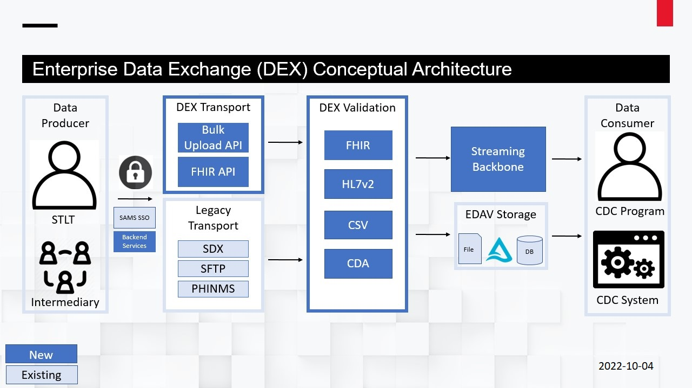
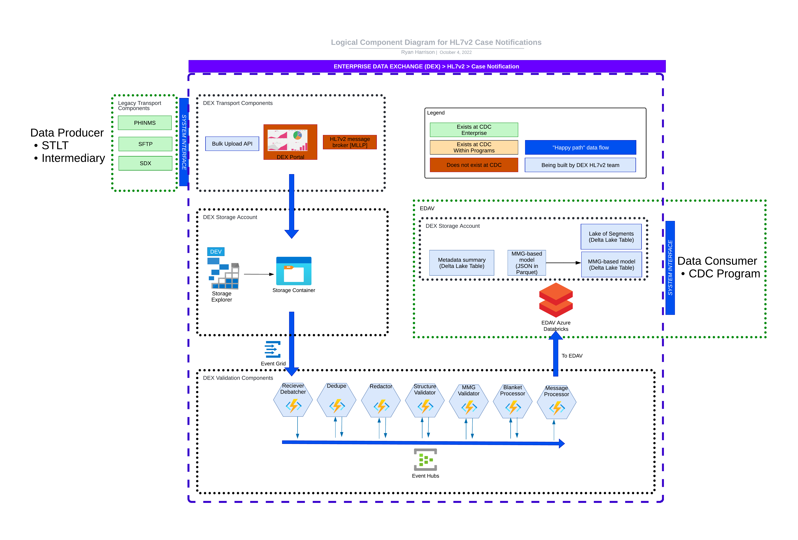

# Enterprise Data Exchange (DEX) Architecture Snapshot

We provide _snapshots_ of a subset of our architecture diagrams for convenience.

Developers, please refer to LucidChart for diagram source, diagram directory and most current revisions.

## Conceptual Architecture

Source: Sharepoint > Data Exchange v7.pptx > Slide 69

Notes
- DEX Validation components are decoupled from DEX Transport, meaning DEX Validation can be used on messages transported by either DEX Transport or Legacy Transport.
- Our primary _conceptual_ data producers are STLTs and Intermediaries.
  * Ex: We consider an IIS (Immunization Information System) as a logical system subsidiary to the STLT business owner.

## Logical Architecture
### DEX Validation > HL7v2

Source: LucidChart > Logical Component Diagram for HL7v2 Case Notifications
