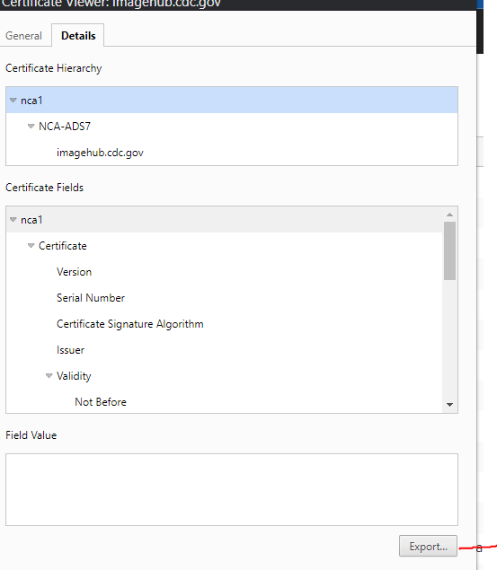

# HL7 pipeline functions project: Receiver-Debatch, Validate, Transform, Validate Content.

## Getting Started
HL7 pipeline functins are written in Kotlin and managed using Maven.  To begin to develop on them, the following software needs to be installed:
- Java 11
- Maven (Latest Version)
- Azure CLI (Latest Version)

### Setting up Maven
These projects pull their dependencies from a CDC internal Nexus repository, located at [imagehub.cdc.gov](imagehub.cdc.gov).  In order to tell Maven to pull from this repo, you need to your local `.m2/settings.xml`.  This is usually located at `{home}/.m2/settings.xml`.  Here is what your `settings.xml` file needs to include:
```XML
<?xml version='1.0' encoding='UTF-8'?>
<settings xsi:schemaLocation='http://maven.apache.org/SETTINGS/1.0.0 http://maven.apache.org/xsd/settings-1.0.0.xsd'
          xmlns='http://maven.apache.org/SETTINGS/1.0.0' xmlns:xsi='http://www.w3.org/2001/XMLSchema-instance'>
    <mirrors>
        <mirror>
            <id>nexus</id>
            <url>https://imagehub.cdc.gov/repository/maven-ede-group/</url>
            <mirrorOf>*</mirrorOf>
        </mirror>
    </mirrors>
    <profiles>                                                                                                     
        <profile>                                                                                                                             
          <id>nexus</id>                                                                                                            
          <repositories>  
            <repository>                                                                                                                      
              <id>nexus</id>                                                                                                            
              <url>https://imagehub.cdc.gov/repository/maven-ede-group/</url>                                                           
              <releases>                                                                                                                      
                <enabled>true</enabled>                                                                                                       
              </releases>                                                                                                                     
              <snapshots>                                                                                                                     
                <enabled>true</enabled>                                                                                                       
              </snapshots>                                                                                                                    
            </repository>    
          </repositories>                                                                                                                                                                                                                                 
        </profile>                                                                                                                            
    </profiles>                                                                                                                             
    <activeProfiles>                                                                                                                        
      <activeProfile>nexus</activeProfile>                                                                                                  
    </activeProfiles>  
    <servers>
      <server>
        <id>nexus</id>
        <username>{CDC SSO Username}</username>
        <password>{CDC SSO Password}</password>
      </server>
    </servers>
</settings>
```
**Note: Make sure to add your CDC SSO username and password to the nexus server tag.**

### Installing the Nexus Cert
Next, you will need to install the SSL certificate from imagehub into your keystore within your Java installation.  Download this cert by navigating to [imagehub.cdc.gov](imagehub.cdc.gov) and exporting the cert from your browser.  It should look similar to this:


Once you have the cert, import it into your keystore using keytool and the following command:
` keytool -import -keystore /path/to/jdk-11.0.16.1/lib/security/cacerts -trustcacerts -file nca1.crt -alias nca1`

Keytool may ask for a password for the keystore.  It's usually the default password of `changeit`.

## Building and Deploying to Azure
At this point, you should be ready to build the code and deploy the output jar files to Azure functions!  There are several ways to do this:

### Command Line
Use Maven on the command line to build and deploy each project.  Open a terminal and authenticate with Azure using the `az login` command.  After logging in, set your subscription to the desired subscription using the `az account set --subscription {subscription ID}` command.

Next, navigate to one of the HL7 pipeline project subdirectories, such as `fn-mmg-based-transformer`.  Use the `mvn clean package` goal to build the app, but **make sure to specify the function name and resource group that you will be deploying to** and feel free to add the **-DskipTests** flag to skip the integration tests.  The full command should look like this:

`mvn clean package -DfunctionAppName={insert name} -DfunctionResourceGroup={insert rg} -DskipTests`

This should output a .jar file within the `target` directory.  Next, we need to deploy this jar by using the `mvn azure-functions:deploy` goal.  The full command should look like this:

`mvn azure-functions:deploy -DfunctionAppName={insert name} -DfunctionResourceGroup={insert rg} -DskipTests`

The function should be deployed at this time.

### VS Code
VS Code can be used to build and deploy the function using a GUI.  Check out the [official docs](https://learn.microsoft.com/en-us/azure/azure-functions/create-first-function-vs-code-java) for setting that up.

### IntelliJ
Similarly, IntelliJ IDE can provide the same GUI-like experience for building and deploying the functions.  Check out the [official docs](https://learn.microsoft.com/en-us/azure/azure-functions/functions-create-maven-intellij?toc=%2Fazure%2Fdeveloper%2Fjava%2Ftoolkit-for-intellij%2Ftoc.json&bc=%2Fazure%2Fdeveloper%2Fbreadcrumb%2Ftoc.json) for setting that up.