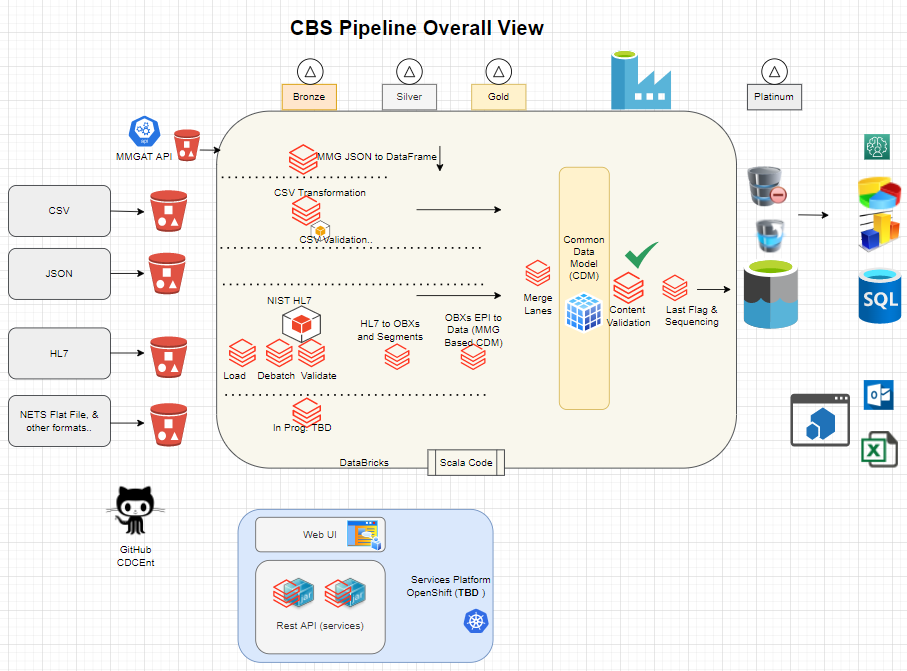
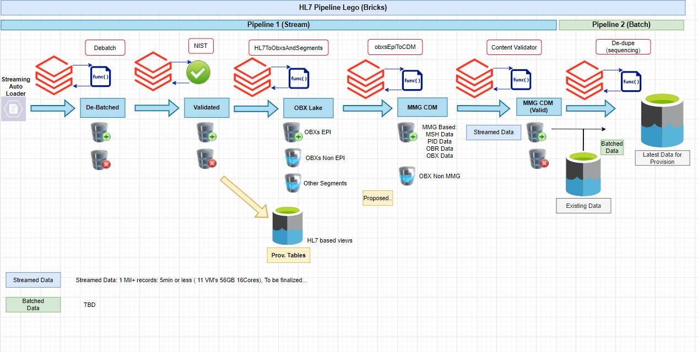

# Case-based Surveillance pipeline

This repository contains code for a case-based surveillance data pipeline proof-of-concept architected using OCIO's EDAV and Azure DataBricks.

This work has been adapted for NNDSS use cases from a serverless data pipeline framework developed for the CDC by the MITRE corporation.

## Required Project Organization Information

* Point of contact: [Erik Knudsen](mailto:knu1@cdc.gov) (Accelerator Team)
* Organizational unit: DDPHSS/CSELS/DHIS/ISB
* Related projects: [NNDSS](https://wwwn.cdc.gov/nndss/)
* Related investments: [NNDSS](https://wwwn.cdc.gov/nndss/), [CSELS DataHub](https://github.com/cdcent/csels-datahub)
* Governance status: Under design / Experimental
* Program official: [Leslyn McNabb](mailto:axe8@cdc.gov), alternate: [Erik Knudsen](mailto:knu1@cdc.gov)

## Pipeline overview

This pipeline ingests CSV and HL7v2 case notifications from the Azure Gen2 Data Lake, validates them for structure, content, and vocabulary, transforms them into a common data model, and then provisions that data model for access by authorized CDC programs.

## Pipeline Libraries

* HL7 Messages Structural Validator: https://github.com/CDCgov/data-exchange-hl7/tree/master/hl7-structural-validator
* HL7 library: https://github.com/mscaldas2012/HL7-PET

## Pipeline Overall View
 
 

## HL7 Pipeline Overall (In Progress)
 
 
