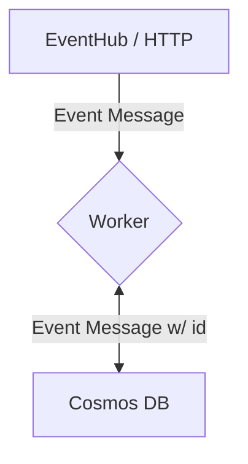

# Cosmos Worker POC

POC for writing to Cosmos DB. Note, the method if initiation was not finalized during the POC build so the code includes logic for both HTTP or EventHub Trigger. 

## Remaining Work
Ultimately, the biggest remaining item is the method of CosmosDB writing. There are multiple ways to write that other developers were looking at. 

In regards to this spike, it is worth noting that event messages cannot be placed into the DB as is. The messages need to include an **id** attribute, the value of which is being set randomly right now but can be updated to copy the message or file id.

There needs to be additional work on manage exceptions and failures to write. For example, if an event fails to be logged there needs to be multiple retries. 

## Configurations

For configurations, there are 4 items required to access and query against CosmosDB. You will need to define the **Connection String**, **Cosmos Key**, **Database Name** and **Container Name** to run a query on the DB. From there,  

## Diagram

