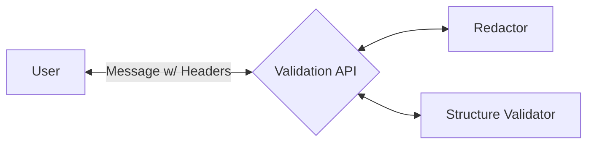

# Validation API POC

POC API for validation. It receives an HL7 message in the request body along with message *type* and message *route* in the headers.

- *x-tp-message_type*
- *x-tp-route*

To run this controller, ensure that IntelliJ is running the Application.kt file. Once the API is up and running, simply send a request to the {url}/validation endpoint. 

The resources folder contains some sample Postman work if needed. 

In terms of configurations, the Validation API requires the **REDACTOR_URL** and **STRUCTURE_URL** to hit the HTTP Functions for each corresponding pipeline function. 

## Diagram

